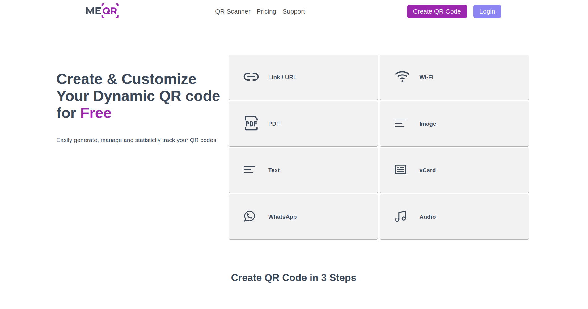
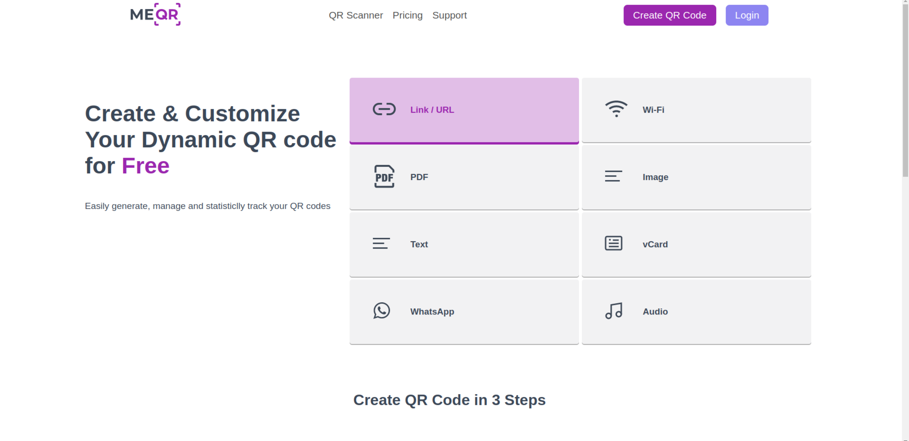
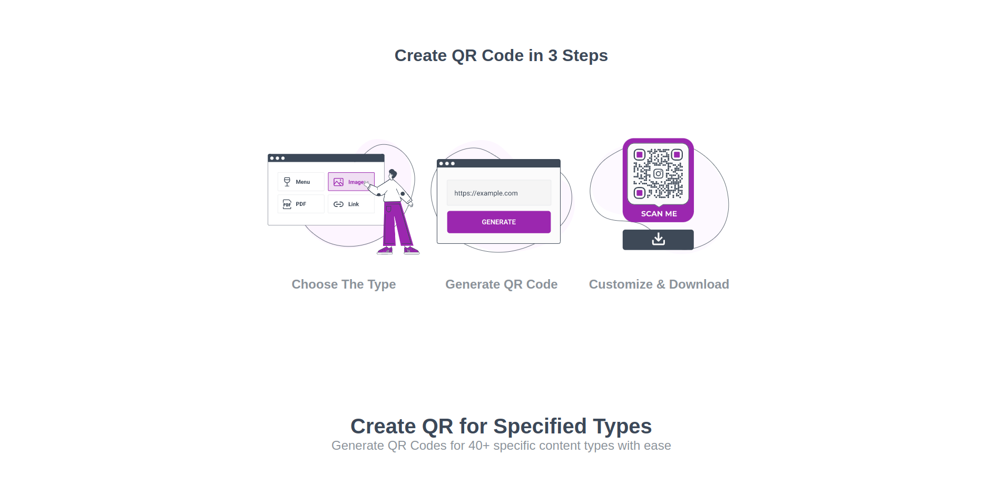
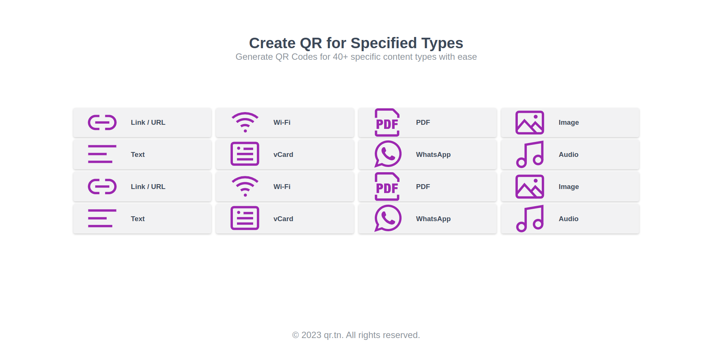
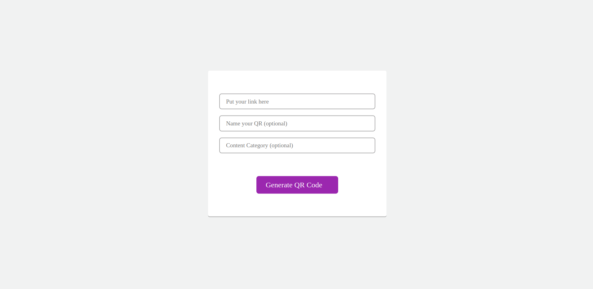

# QR Code Generator - Client-Side

## Overview

This is a simple QR code generator that operates entirely on the client side. It allows users to generate QR codes for various types of data, including email addresses, phone numbers, websites, Wi-Fi information, and locations. The application is designed for ease of use and can be hosted on any static file server.

## Features

- Generate QR codes for different data types:
  - Email addresses
  - Phone numbers
  - Websites
  - Wi-Fi information (SSID and password)
  - Location coordinates

## Usage

1. Open the `index.html` file in a web browser.

2. Input the relevant data (email, phone number, etc.) in the designated fields.

3. Click the "Generate QR Code" button to create the QR code.

4. The generated QR code will be displayed on the screen.

## Hosting

You can host this QR code generator on platforms like GitHub Pages, Netlify, or Vercel. Simply upload the files to your chosen hosting service.

## JS Library

QRCode.js is javascript library for making QRCode. QRCode.js supports Cross-browser with HTML5 Canvas and table tag in DOM. QRCode.js has no dependencies.

## Screen Shot

## License

This project is licensed under the [MIT License](LICENSE).
